# 移除植物
直接使用data call_delete_plant

# 放置植物
## x32dbg附加pvz
tab内存布局，双击地址=00401000 text 可执行代码 一行，能直接跳转到代码段，方便查找
## 断点
从pvztoolkit代码data.cpp读取 call_put_plant，以下均以1051为例，地址为0x0040d120
放置植物后断点触发

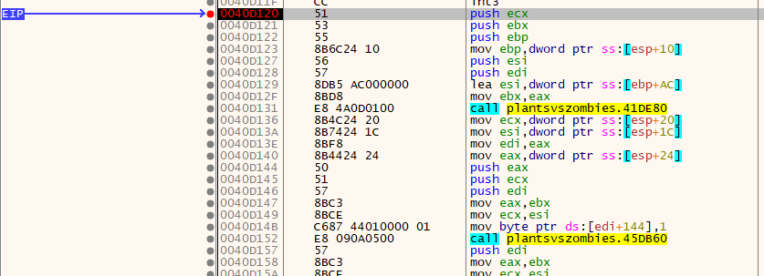

重复两次“运行到返回、步过”，EIP上一行为所需地址

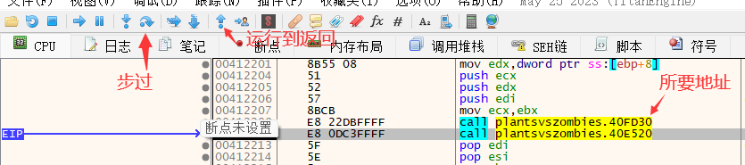

# 选择卡片与释放
## CheatEngine附加
手拿玉米投手不要放下，扫描34，然后手拿玉米加农炮，扫描47，可以直接得到唯一地址
右键地址，选择找出什么写入这个地址
点击手拿植物，右键点击释放植物，分别得到两个地址，记录下

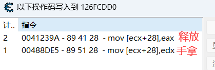

## x32dbg附加
断点上图488DE5，点击卡片触发
重复一次“运行到返回、步过”，EIP上一行为选择卡片地址

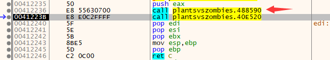

断点上上图41239A，释放卡片触发
重复两次“运行到返回、步过”，EIP上一行为释放卡片地址

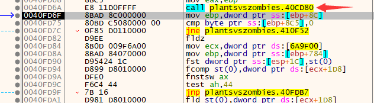

# 发炮
## CheatEngine附加
种植玉米加农炮，炮填充状态为37，空状态（非发炮或填充过程中）为35，扫描若干次
定位地址后，找出什么写入这个地址，然后发炮

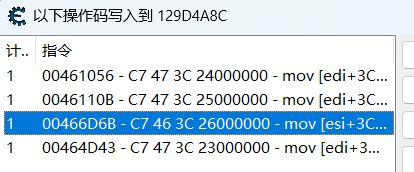
有多个地址，注意找发炮瞬间的，此处为466D6B

## x32dbg附加
断点466D6B，发炮时触发
重复一次“运行到返回、步过”，EIP上一行为发炮地址

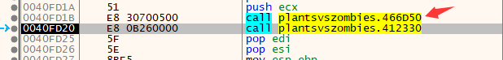

# Rock开始游戏
## CheatEngine偏移地址
找到卡槽数量的偏移，依次是data里的lawn，board，slot，slot_count

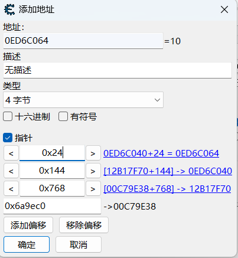
右键添加的地址，找出谁访问了这个地址，找出什么访问这个指针指向的地址

点击lets rock按钮后出现1，1，10次，选择中间那个，显示反汇编程序

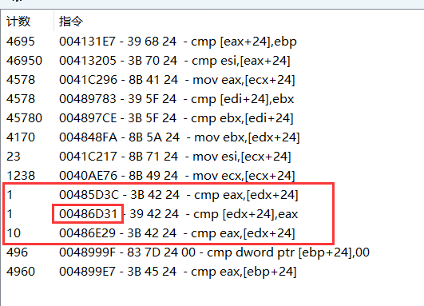

汇编窗口中往上找到函数入口，即为地址

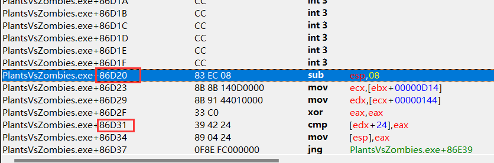
### Rock call年度版和原版的调用约定不同！！！

# 选卡
同Rock，找到卡槽数量的偏移，依次是data里的lawn，board，slot，slot_count
右键添加的地址，找出谁访问了这个地址，找出什么访问这个指针指向的地址
进行选卡，卡选满后继续选卡，可以看到一个函数不变一个函数继续增加

选择继续增加那个，查看汇编，往上找到函数入口即为地址

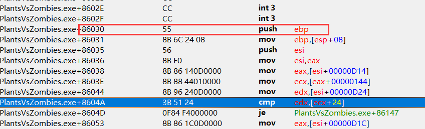